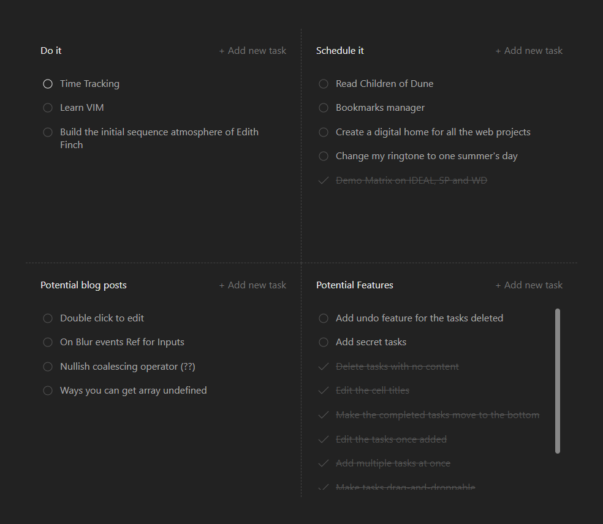

<h1 align="center">
  Eisen
</h1>

<h4 align="center">
    A simple to-do list application
</h4>

  

## Description

Eisen (working title) is a very simple task management tool (inspired by the Eisenhower matrix) that allows you to organize your tasks based on their urgency and importance. Depending on which you will be able to separate them into one of the four cells:

- Do it (Things with clear deadlines and consequences for not taking immediate action)
- Schedule it (Things with no clear deadlines but within your best interests to spend some of your time on)
- Delegate it (Things that need to be done but doesn't necessarily require your skillset)
- Delete it (Distractions which you should be mindful about spending time on)

All data is written into your browser's local storage and not stored anywhere else.

## Features

- [x] Quick and simple to use
- [x] Reorder tasks based on their priority
- [x] Move tasks in-between cells
- [x] Edit the titles of cells
- [x] Add multiple tasks in a single go
- [x] Edit the tasks once they are added
- [x] Undo tasks once deleted
- [x] Ability to add hidden tasks
- [x] Ability to change colors

- [ ] Authentication and syncing

## Usage

### Create a task

#### - Clicking on "Add new task"

You can click on the Link (which will be replaced with a button in a future version) to add a new task. An input form will be focused and it also shows the cell you are adding the task to.

#### - Use `Alt` + `1-4`

You can also add tasks by using the keyboard combination of `Alt` + `1` to `4`. The numbers are mapped in `row-major-order`.

### Mark as complete and Delete

- You can mark a task as complete by clicking on the circle before the task
- You can then delete the task by clicking on the task text
- You can click again on the tick to return to its original uncomplete state

Tasks that are marked as complete move to the bottom of the list. This might look glitchy as of now but will be fixed with a smooth transition in a future version.

### Edit the Cell titles/ tasks

Although the Eisenhower matrix is a very useful framework for prioritizing tasks, you might not be using all of the default cells. So you can keep the original titles are the cells that you want to keep using but change the others.

- You can change the titles by double-clicking on the title and typing your title
- Tasks can also be edited once they are added by double-clicking on them

### Reordering and Moving tasks

Reordering acts as a way to visually prioritize tasks within their cells. Moving tasks in-between cells is an important feature because a task in the "Schedule it" cell could be moved to the "Do it" cell when its urgency is increased.

- Reordering and Moving tasks can be done by dragging and dropping them

The current version only partially supports drag and drop using the keyboard. Will be fixed.
